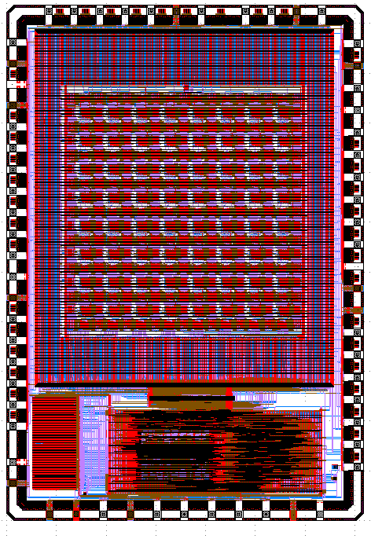

# CLEAR

The repo contains the FPGA layout integration with the [Caravel](https://github.com/efabless/caravel.git) chip. The content of the repo represemt the first generation version of CLEAR delivered by [@Manarabdelaty](https://github.com/Manarabdelaty/Caravel-OpenFPGA-EF)

The layout is an 8x8 FPGA fabric generated using [OpenFPGA](https://github.com/lnis-uofu/OpenFPGA) and hardened using [OpenLane](https://github.com/efabless/openlane).  

# Caravel Integration

### Verilog View

The 8x8 fpga interface to the managent area can be found at [user_project_wrapper.v](verilog/rtl/user_project_wrapper.v) . The fabric is conncted to the managemtent area logic analyzer, wishbone bus, and IO-ports. 

| Caravel-IO    | FPGA           |  Mode
| ------------- | -------------- | -------------
| io[0]     | test_en         | Input
| io[1]     | IO_ISOL_N       | Input
| io[7:2]   | EMBED-IO[10:15] | Bi-directional
| io[11]    | sc_tail         | Output
| io[12]    | ccff_head       | Input  
| io[13:14] | EMBED-IO[8:9]   | Bi-directional
| io[17:23] | EMBED-IO[1:8]   | Bi-directional
| io[24]    | EMBED-IO[0]*    | Bi-directional
| io[25]    | wb_la_switch    | Input
| io[26]    | sc_head         | Input
| io[27:34] | EMBED-IO[88-95] | Bi-directional 
| io[35]    | ccff_tail       | Output
| io[36]    | clk             | Input
| io[37]    | prog_clk        | Input
        
### GDS View

